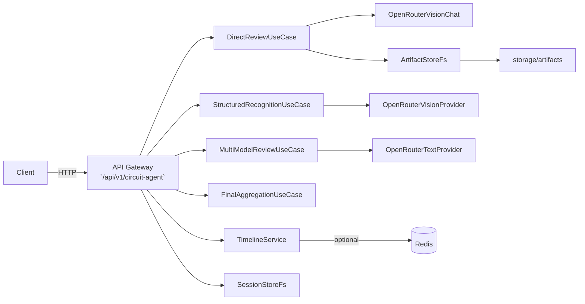

## Circuit Agent (circuit-agent)

This document summarizes the architecture, runtime configuration, APIs, and operational guidance for the `circuit-agent` service. It was produced after a file-by-file review of the `services/circuit-agent` source code. Please keep this document synchronized with code and prompt files (`ReviewAIPrompt/`).

### Summary

`circuit-agent` performs image-to-structure conversion and LLM-based circuit review. Main functions:

- Direct review (direct mode): send attachments and prompts to a vision/text LLM and return a Markdown review.
- Structured recognition (structured mode): multi-pass recognition to produce a `CircuitGraph` (components/nets), optional external search & summarization, followed by parallel text reviews and final aggregation.
- Session and artifact management (file-based storage with static access routes).

Defaults (verified in source):

- BASE_PATH: `/api/v1/circuit-agent` (see `src/config/config.ts`)
- PORT: `4001` (overridable via `PORT` environment variable; see `src/config/config.ts`)
- Prompts: stored under `ReviewAIPrompt/{agent}/...`. System prompts follow `system_prompt_{variant}_{lang}.md` or `system_prompt_{lang}.md` (see `src/infra/prompts/PromptLoader.ts`).

### Quick start (development)

1. Install dependencies and run:
```
cd services/circuit-agent
npm install
npm run dev
```

2. Health check example:
```
GET http://localhost:4001/api/v1/circuit-agent/health
```

3. Important environment variables: `PORT`, `OPENROUTER_BASE`, `REDIS_URL`, `LLM_TIMEOUT_MS`, `VISION_TIMEOUT_MS`, `STORAGE_ROOT` (see `src/config/config.ts`).

### High-level layout

```
src/
  bootstrap/        # server startup & route registration
  config/           # loadConfig()
  interface/http/   # express routes & handlers
  app/              # use-cases (DirectReview, StructuredRecognition, etc.)
  infra/            # providers, prompt loader, storage, search
  domain/           # types & contracts
storage/             # artifacts / sessions / tmp
```

### Architecture (mermaid)



### API details (base path: `/api/v1/circuit-agent`)

Notes:

- Authentication: the service will forward `Authorization` header to upstream LLM providers but does not persist keys. Put authentication and rate limiting at the gateway/reverse-proxy in production.
- File uploads: multipart/form-data; the server reads uploaded files into Buffers and removes temporary files after processing.
- Error responses are typically `{ error: 'message', details?: '...' }`.

- GET `/health`
  - Returns: `{ status: 'ok', service: 'circuit-agent', endpoint: 'health' }`

- GET `/progress/:id`
  - Returns: `{ timeline: [...] }` (TimelineService-backed progress entries)

- GET `/artifacts`
  - Returns a JSON list of artifact filenames and URLs (compat/debug route)

- GET `/artifacts/:filename`
  - Static file access for saved artifacts

- GET `/system-prompt?lang=zh|en`
  - Returns the system prompt as plain text from `ReviewAIPrompt/` or repo root (404 if missing)

- POST `/modes/direct/review` (multipart)
  - Required: `apiUrl`, `model`
  - Optional: `language` (`zh`|`en`, default `zh`), `history`, `requirements`, `specs`, `dialog`, `progressId`, `enableSearch`, `auxModel`, etc.
  - Behavior summary:
    - Loads system prompt using `PromptLoader` (chooses `initial` or `revision` variant based on `history`).
    - Converts attachments to data URLs and builds a rich message payload for the vision/text provider.
    - If `enableSearch=true` and a search provider is injected: perform IdentifyKeyFacts → OpenRouterSearch → per-URL summarization (`summarizeUrl()`), save summaries as artifacts, inject summaries as additional system messages, and append search events to the timeline/progress store.
    - Calls upstream vision/text provider and saves request/response artifacts; writes llm.request/llm.response events to timeline.
  - Returns: `{ markdown: '...', timeline: [...], searchSummaries?: [...] }`

- POST `/modes/structured/recognize` (multipart)
  - Required: `apiUrl`, `visionModel` (default `openai/gpt-5-mini`)
  - Returns: `{ circuit: CircuitGraph, timeline: [...] }`

- POST `/modes/structured/review` (json)
  - Required: `apiUrl`, `models` (array)
  - Body example: `{ apiUrl, models, circuit, systemPrompt, requirements, specs, dialog, history, progressId }`
  - Returns: multi-model review outputs (reports, timeline)

- POST `/modes/structured/aggregate` (multipart)
  - Aggregates multiple reports into final Markdown using FinalAggregationUseCase
  - Returns: `{ markdown, timeline }`

### Prompt file convention (verified)

`PromptLoader` loads prompts from `ReviewAIPrompt/{agent}/{filename}`. Conventions:

- System prompts: `system_prompt_{variant}_{language}.md` (e.g. `system_prompt_initial_zh.md` or `system_prompt_revision_en.md`) or `system_prompt_{language}.md`.
- Pass prompts (identify/macro/net/verify/etc.): `{variant}_prompt.md` (e.g. `identify_prompt_zh.md`).

The service will throw `PromptLoadError` if required prompt files are missing or empty.

### Operational guidance & security

- Do not log or persist full `Authorization` headers or API keys.
- Treat artifacts as sensitive (they may contain raw LLM JSON). Limit artifact access in shared deployments.
- Use a gateway for authentication and rate limiting; avoid exposing the service directly to the public internet.

### Logs and troubleshooting

- Logs: `services/circuit-agent/logs/out.log`, `err.log`, and artifacts inside the storage root.
- Common failures: `PromptLoadError` (missing prompt files), upstream 4xx/5xx (incorrect `apiUrl`/`model`), structured recognition 422 (low confidence or conflicts).

### Verified assumptions (evidence)

- `basePath` and `port`: see `services/circuit-agent/src/config/config.ts` (defaults `basePath: '/api/v1/circuit-agent'`, `port: 4001`).
- Prompt naming & paths: see `services/circuit-agent/src/infra/prompts/PromptLoader.ts`.

### Notes

If you want, I can also produce a synchronized English/Chinese pair for the repository root `README.md` and `CURSOR.md` and write them. I will proceed once you confirm.

