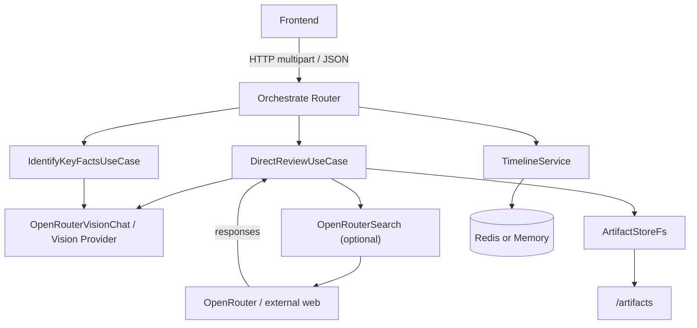

# circuit-agent service (English)

Summary
---
`circuit-agent` is the backend microservice in ReviewAI responsible for schematic image/PDF recognition and LLM-based review orchestration. It accepts attachments and context, calls vision/text upstream providers, and stores generated artifacts (requests, responses, summaries) for frontend and devops inspection.

Key Capabilities
---
- Accept multipart uploads (images/PDF) and convert attachments into data-URLs for vision providers.
- Optional Identify pass extracts key components and technical routes used for optional online search.
- Optional online search (`enableSearch`) performs per-keyword queries and URL summarization; summaries are injected as system messages.
- Direct review use case: build rich messages, call upstream vision/text models, return Markdown report and timeline.
- Artifacts saved to `STORAGE_ROOT` and exposed via static `/artifacts` route.

Quickstart (development)
---
Prerequisite: Node.js >= 18

1. Install dependencies:

```bash
cd services/circuit-agent
npm install
```

2. Start the service (dev):

```bash
# recommended: start all services from repo root
node ../../start-all.js

# or single-service if available
npm run dev
```

3. Default port & base path
---
- Default port: 4001
- Default base path: `/api/v1/circuit-agent`

Runtime config (common env vars)
---
- `PORT` — override server port
- `OPENROUTER_BASE` — upstream provider base URL
- `REDIS_URL` — optional Redis connection URL for progress storage
- `LLM_TIMEOUT_MS`, `VISION_TIMEOUT_MS` — timeouts
- `STORAGE_ROOT` — root folder for artifacts and sessions

- `KEEP_ALIVE_MSECS`, `FETCH_RETRIES` — network/keep-alive and retry related settings

Strict Preload (all environments)
---
The service enforces Strict Preload of prompt files in all environments: any missing or semantically empty required prompt causes fail-fast at startup (non-zero exit) within 10 seconds. No configuration may relax this behavior inside the service process. For troubleshooting, you may use an external "pre-check script" to temporarily skip checks, but this does not affect the service's strict startup policy.

The health endpoint can expose the latest preload duration metric for monitoring (see SC-001/SC-002 in the feature spec).

Architecture (Mermaid)
---


Major APIs
---
All endpoints are prefixed by the service base path (e.g. `/api/v1/circuit-agent`).

- `GET /health`
  - Health check

- `GET /progress/:id`
  - Retrieve timeline/progress by `progressId`

- `GET /system-prompt?lang=zh|en`
  - Retrieve the system prompt file used for the agent
  - Parameter: `lang` (optional, default `zh`)

- `POST /orchestrate/review` (recommended)
  - Unified orchestration entrypoint. Current implementation requires `directReview=true` (structured mode removed).
- `POST /modes/structured/*` (410 Gone)
  - Structured mode has been removed. Use `POST /orchestrate/review` with `directReview=true` instead.
  - Content-Type: `multipart/form-data`
  - Form fields:
    - `apiUrl` (string, required)
    - `model` (string, required)
    - `directReview` (`true`|`false`, required) — must be `true`
    - `language` (`zh`|`en`, optional)
    - `history` (JSON array or JSON string, optional)
    - `enableSearch` (`true`|`false`, optional)
    - `auxModel` (string, optional)
    - `requirements`, `specs`, `dialog` (string)
    - `progressId` (string, optional)
  - Response:
    - `markdown` — generated report
    - `timeline` — timeline entries (identify/search/llm request/response)
    - `searchSummaries` — injected external summaries when enableSearch succeeded

- `POST /modes/direct/review`
  - Direct entrypoint mapped to `DirectReviewUseCase` (same semantics as the orchestrate direct branch).

- Session APIs: `POST /sessions/save`, `GET /sessions/list`, `GET /sessions/:id`, `DELETE /sessions/:id`

- Artifact listing and static access: `GET /artifacts` and `/artifacts/:filename` (static)

Example curl (orchestrate):

```bash
curl -X POST "http://localhost:4001/api/v1/circuit-agent/orchestrate/review" \
  -F "apiUrl=https://api.openrouter.example" \
  -F "model=openai/gpt-5-mini" \
  -F "directReview=true" \
  -F "language=zh" \
  -F "files=@schematic.png" \
  -F "requirements=Must meet X"
```

Usage guidance and best practices
---
- Prompt files: ensure `ReviewAIPrompt/circuit-agent/` contains required prompt files (e.g. `system_prompt_initial_zh.md`). Missing or empty files will cause prompt loader to throw `PromptLoadError` and endpoints to return 500.
- enableSearch: enabling online search introduces external content injection into system prompts — verify compliance and content quality. The service will attempt to fallback gracefully on failures.
- Artifacts: artifacts may contain full request/responses — restrict access in production or implement sanitization.
- API Key: frontend may persist an API key in localStorage for convenience during development, but do NOT store production keys in shared environments.

Troubleshooting
---
- `Failed to load system prompt`: check `ReviewAIPrompt/` files exist and are non-empty.
- `artifacts not found` (404): check `STORAGE_ROOT/artifacts` exists and is populated.
- Progress loss: missing/invalid `REDIS_URL` will cause fallback to memory progress store which is ephemeral.

Developer notes
---
- Key files:
  - `src/bootstrap/server.ts` — bootstrapping and route registration
  - `src/interface/http/routes/orchestrate.ts` — orchestration and search pipeline
  - `src/app/usecases/DirectReviewUseCase.ts` — direct review implementation
  - `src/app/usecases/IdentifyKeyFactsUseCase.ts` — identify pass implementation
  - `src/infra/prompts/PromptLoader.ts` — prompt loader
  - `src/infra/search/OpenRouterSearch.ts` — search & summarize provider
  - `src/infra/storage/ArtifactStoreFs.ts` — artifact storage

Change log (doc addition)
---
- 2025-10-12: Added `services/circuit-agent/README.md` with API details, architecture and flow diagrams. After your confirmation I will append a `CURSOR.md` entry describing this documentation change.

