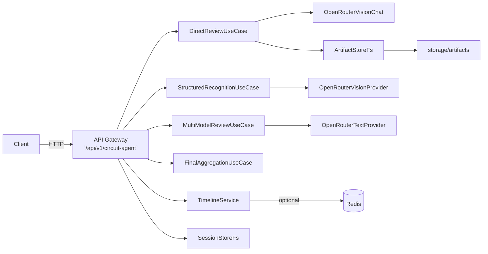

## 电路图评审 Agent（服务说明）

此文档基于对 `services/circuit-agent` 源代码的逐文件审阅编写，包含架构概览、运行配置、API 详解与运维建议。请在代码或提示词变更后同步更新此文件与仓库根目录的文档。

### 概要

`circuit-agent` 将图像转换为结构化电路 (`CircuitGraph`) 并基于 LLM 生成评审报告。主要功能：

- 直接评审（direct mode）：将附件与系统提示词发送给视觉/文本 LLM，返回 Markdown 报告。
- 结构化识别（structured mode）：多轮识别生成 `CircuitGraph`，可选联网检索并摘要外部资料，随后并行文本评审并最终整合为报告。
- 会话与工件管理：文件系统存储 artifacts，并提供静态访问路由。

默认配置（代码验证）：

- 基路径（BASE_PATH）：`/api/v1/circuit-agent`（见 `src/config/config.ts`）
- 端口（PORT）：`4001`（可通过环境变量 `PORT` 覆盖）
- 提示词位置：`ReviewAIPrompt/{agent}/...`，系统提示词命名规则为 `system_prompt_{variant}_{lang}.md` 或 `system_prompt_{lang}.md`（见 `src/infra/prompts/PromptLoader.ts`）

### 快速开始

1. 进入目录并安装依赖：
```
cd services/circuit-agent
npm install
npm run dev
```

2. 健康检查：
```
GET http://localhost:4001/api/v1/circuit-agent/health
```

### 高层目录结构

```
src/
  bootstrap/        # 启动与路由注册
  config/           # 加载运行时配置
  interface/http/   # express 路由与处理器
  app/              # 用例实现（DirectReview、StructuredRecognition 等）
  infra/            # 提供者、提示词加载、存储、检索实现
  domain/           # 领域类型与契约
storage/             # artifacts / sessions / tmp
```

### 架构图（mermaid）



### API 详解（基路径：`/api/v1/circuit-agent`）

备注：

- 认证：服务会把 `Authorization` 头透传至上游模型提供者，但不在服务端持久化；生产环境建议由网关负责鉴权与限流。
- 文件上传：multipart/form-data；服务会读取文件为 Buffer，并在处理结束后删除临时文件。
- 错误返回通常为 `{ error: 'message', details?: '...' }`。

- GET `/health`
  - 返回：`{ status: 'ok', service: 'circuit-agent', endpoint: 'health' }`

- GET `/progress/:id`
  - 返回：`{ timeline: [...] }`（由 TimelineService 提供）

- GET `/artifacts`
  - 返回 artifacts 列表（兼容调试路由）

- GET `/artifacts/:filename`
  - 静态访问已保存 artifact

- GET `/system-prompt?lang=zh|en`
  - 返回 `ReviewAIPrompt/` 或仓库根下的 system prompt 文本（若缺失返回 404）

- POST `/modes/direct/review` (multipart)
  - 必需：`apiUrl`, `model`
  - 可选：`language`（`zh`|`en`，默认 `zh`）、`history`、`requirements`、`specs`、`dialog`、`progressId`、`enableSearch`、`auxModel` 等
  - 行为概述：
    - 使用 `PromptLoader` 加载 system prompt（根据 `history` 判断 `initial` 或 `revision` 变体）。
    - 将附件转换为 data URL 并构建 rich messages 传入视觉/文本 provider。
    - 若 `enableSearch=true` 且注入了 search provider：执行 IdentifyKeyFacts → OpenRouterSearch → per-URL summarize，保存摘要为 artifact，注入为额外 system 消息，并将检索事件写入 timeline/progress。
    - 调用上游 provider，保存 request/response artifacts，并写入 llm.request/llm.response timeline 事件。
  - 返回：`{ markdown, timeline, searchSummaries? }`

- POST `/modes/structured/recognize` (multipart)
  - 必需：`apiUrl`, `visionModel`（默认 `openai/gpt-5-mini`）
  - 返回：`{ circuit: CircuitGraph, timeline }`

- POST `/modes/structured/review` (json)
  - 必需：`apiUrl`, `models`（数组）
  - 请求示例：`{ apiUrl, models, circuit, systemPrompt, requirements, specs, dialog, history, progressId }`
  - 返回：并行文本评审输出（reports 与 timeline）

- POST `/modes/structured/aggregate` (multipart)
  - 聚合多模型评审结果为最终 Markdown（FinalAggregationUseCase）

### 提示词约定（已验证）

提示词由 `PromptLoader` 从 `ReviewAIPrompt/{agent}/{filename}` 加载，命名约定：

- 系统提示词：`system_prompt_{variant}_{lang}.md` 或 `system_prompt_{lang}.md`
- pass 类型提示词（identify/macro/net/verify 等）：`{variant}_prompt.md`

服务在提示词缺失或文件为空时会抛出 `PromptLoadError`。

### 运维与安全建议

- 不要在日志或 artifact 中持久化完整的 `Authorization` 头或 API Key。
- 将 artifacts 视为敏感数据并在生产环境限制其访问。
- 在网关层实现鉴权与速率限制，避免直接暴露服务。

### 日志与排错

- 日志位置：`services/circuit-agent/logs/out.log`、`err.log` 与 storage 下的 artifacts。
- 常见故障：`PromptLoadError`、上游 4xx/5xx、结构化识别置信度问题（422）。

### 核实的假设（证据链接）

- `basePath` 与 `port`：见 `services/circuit-agent/src/config/config.ts`（默认 `basePath: '/api/v1/circuit-agent'`，`port: 4001`）。
- 提示词命名與加载：见 `services/circuit-agent/src/infra/prompts/PromptLoader.ts`。


