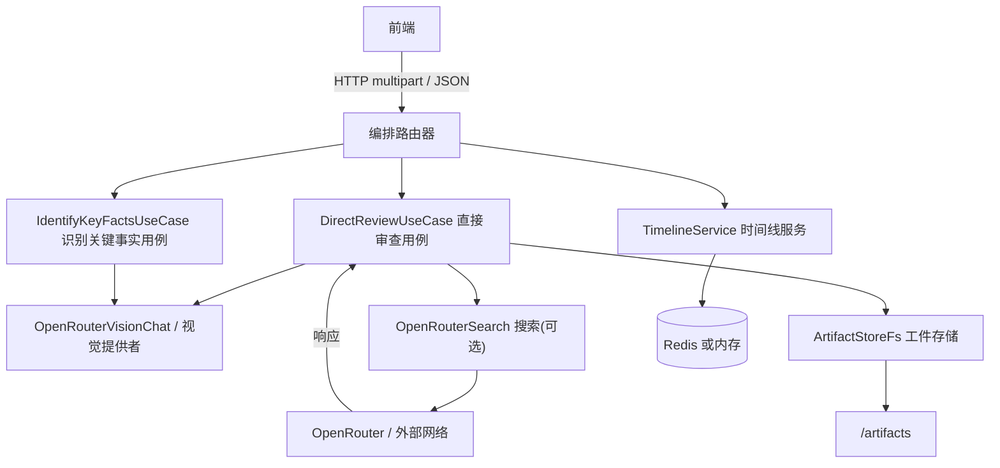
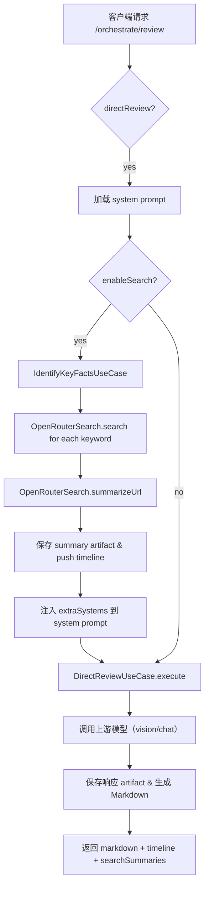

# circuit-agent 服务（中文说明）

简短说明
---
`circuit-agent` 是 ReviewAI 项目中负责电路原理图视觉识别与基于 LLM 的自动评审编排后端服务。它接收图片/PDF 附件与文本上下文，调用视觉/文本上游模型进行识别与评审，并将生成的 Markdown 报告与调试工件以 artifact 形式保存供前端与运维查看。

主要功能
---
- 图像/PDF 附件上传（multipart）并转换为 data-url 发送给视觉上游；
- 可选识别轮（Identify）抽取关键元器件与技术路线并用于联网检索；
- 可选联网检索（enableSearch），对检索到的 URL 逐条摘要并注入为 system 消息；
- 直接评审（direct review）用例：将上下文与附件发送给视觉/文本模型，返回 Markdown 报告与 timeline；
- 工件保存：请求/响应与摘要会保存为 artifact，提供静态访问与列表接口；
- 会话保存/加载（sessions）。

快速开始（开发）
---
前提：Node.js >= 18

1. 在仓库根目录或服务目录安装依赖：

```bash
cd services/circuit-agent
npm install
```

2. 启动（开发调试）：

```bash
# 推荐在仓库根使用一键脚本启动全部服务
node ../../start-all.js

# 或单服务启动（若 package.json 提供）
npm run dev
```

3. 默认端口与基路径（请参阅 `config`）：
- 默认端口：4001
- 默认基路径：`/api/v1/circuit-agent`

运行时环境变量（常用）
---
- `PORT` — 覆盖服务端口
- `OPENROUTER_BASE` — 上游模型提供者的 base URL（OpenRouter 兼容）
- `REDIS_URL` — 可选：Redis 连接字符串（进度存储优先使用）
- `LLM_TIMEOUT_MS` — LLM 请求超时（毫秒）
- `VISION_TIMEOUT_MS` — 视觉请求超时（毫秒）
- `STORAGE_ROOT` — 工件与会话的存储根目录（默认仓库内）
- `KEEP_ALIVE_MSECS`, `FETCH_RETRIES` 等超时/重试配置

严格预热（所有环境）
---
服务在所有环境中强制启用严格预热（Strict Preload）：任一必需提示词缺失或语义空白将导致启动阶段 fail-fast 并中止（非 0 退出）。服务进程内不允许通过任何配置放宽该策略；如需排障，仅可在服务外部使用“预检脚本”临时跳过，不影响服务进程的严格策略。

健康端点可暴露最近一次预热耗时指标，便于监控与验收（参见本特性规格的 SC-001/SC-002）。

核心架构（Mermaid）
---


主要 API（详解）
---
所有路径均以基路径为前缀（例如：`/api/v1/circuit-agent`）。下列示例使用该基路径。

- `GET /health`
  - 描述：服务健康检查
  - 请求：无
  - 响应：200/JSON 简要状态

- `GET /progress/:id`
  - 描述：查询进度（timeline）
  - 请求：URL path 参数 `id`（progressId）
  - 响应：timeline JSON

- `GET /system-prompt?lang=zh|en`
  - 描述：返回当前系统提示词（供前端展示/下载）
  - 参数：`lang`（可选，默认 `zh`）

- `POST /orchestrate/review` （推荐使用）
  - 描述：统一编排入口，当前仅支持 `directReview=true`（structured 已退役）
  - Content-Type：`multipart/form-data`（支持 `files` 上传）
  - 常用字段（form）：
    - `apiUrl` (string, required) — 上游 OpenRouter 或兼容提供者的 base URL
    - `model` (string, required) — 上游模型名称（例如 `openai/gpt-5-mini`）
    - `directReview` (string 'true'|'false', required) — 必须为 `true`
    - `language` ('zh'|'en', optional) — 提示词语言
    - `history` (JSON array or JSON string, optional) — 历史会话，元素形如 `{ role: 'user'|'assistant', content: '...' }`
    - `enableSearch` ('true'|'false', optional) — 是否启用检索轮（identify->search->summarize）
    - `auxModel` (string, optional) — 副模型（用于检索/摘要），优先于 `model`
    - `requirements`, `specs`, `dialog` (string, optional)
    - `progressId` (string, optional) — 进度追踪 ID（用于前端轮询 `GET /progress/:id`）
  - 返回示例（200）：
    - `markdown` (string) — 生成的 Markdown 报告
    - `timeline` (array) — 本次请求的 timeline 条目（包含 search/identify/llm 请求/响应）
    - `searchSummaries` (array) — 若启用检索且成功，会返回注入的外部摘要文本数组

- `POST /modes/direct/review` （原始直评路由）
  - 描述：直接调用 `DirectReviewUseCase`，行为与 `orchestrate` 中 direct 分支一致
  - 请求：multipart/form-data，字段同上（省略 orchestrate 的 wrapper 逻辑）

- `POST /sessions/save`, `GET /sessions/list`, `GET /sessions/:id`, `DELETE /sessions/:id`
  - 描述：会话的持久化与管理（SessionStoreFs）

- `GET /artifacts` / `GET /artifacts/:filename`
  - 描述：列出或访问已保存的 artifact（请求服务会将 artifacts 挂载为静态目录）

调用示例（orchestrate + curl）：

```bash
curl -X POST "http://localhost:4001/api/v1/circuit-agent/orchestrate/review" \
  -F "apiUrl=https://api.openrouter.example" \
  -F "model=openai/gpt-5-mini" \
  -F "directReview=true" \
  -F "language=zh" \
  -F "files=@schematic.png" \
  -F "requirements=满足XX性能"
```

使用规范与最佳实践
---
- 提示词管理：`ReviewAIPrompt/circuit-agent/` 下必须包含所需提示词文件（`system_prompt_initial_zh.md` 等）。若缺失，服务会在加载时抛出 `PromptLoadError` 并返回 500。请使用 Git 管理提示词变更。
- enableSearch：启用后会执行识别轮（Identify）并对关键词做在线检索并摘要，可能引入外部信息，注意合规与隐私风险；若上游不可用或摘要失败，系统会尽量回退且继续直评流程。
- Artifact 与隐私：artifact 可能包含完整的上游请求/响应 JSON，请在生产环境中限制 `artifacts` 静态路径访问或对工件做脱敏处理。
- API Key：前端可在本地存储 `apiKey` 便于测试，但请勿在共享环境保存明文 API key。

流程图（Orchestrate -> direct with search pipeline）
---


常见故障与排查
---
- Failed to load system prompt：检查 `ReviewAIPrompt/circuit-agent/` 下对应文件是否存在且非空。
- artifacts not found（404）：确认 `STORAGE_ROOT` 下的 `artifacts` 目录是否存在并包含文件。
- 进度不可见：若 `REDIS_URL` 配置错误，服务会回退到内存存储，短期内重启会丢失进度。

开发者说明
---
- 关键文件位置：
  - `src/bootstrap/server.ts` — 服务启动与路由挂载
  - `src/interface/http/routes/orchestrate.ts` — 编排入口与 search pipeline
  - `src/app/usecases/DirectReviewUseCase.ts` — 直评用例实现
  - `src/app/usecases/IdentifyKeyFactsUseCase.ts` — 识别轮实现
  - `src/infra/prompts/PromptLoader.ts` — 提示词加载器
  - `src/infra/search/OpenRouterSearch.ts` — 联网检索/摘要提供器
  - `src/infra/storage/ArtifactStoreFs.ts` — 工件保存实现

- 修改约定：任何对提示词或流程的修改，请同时更新 `ReviewAIPrompt/` 与 `CURSOR.md` 中的变更记录。

变更记录（此处为文档新增说明）
---
- 2025-10-12：新增并同步 `services/circuit-agent/README.zh.md`，文档涵盖 API、架构图、流程图与使用规范。请确认内容后我将生成英文版本并在 `CURSOR.md` 中追加同步记录。

