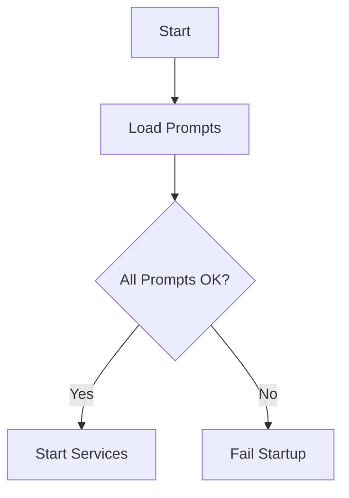

# README 模板（中文）

## 项目概述

简要说明服务的职责与作用。

## 快速开始

示例：

```powershell
npm install
node start
```

## API 列表

列出主要端点及示例请求/响应。

## 示例调用

给出 3-5 个典型调用示例。

## 启动/停止

描述如何在开发/生产环境启动与停止服务。

## 依赖说明

列出主要依赖与系统要求（Node.js 版本等）。

## Mermaid 流程图




